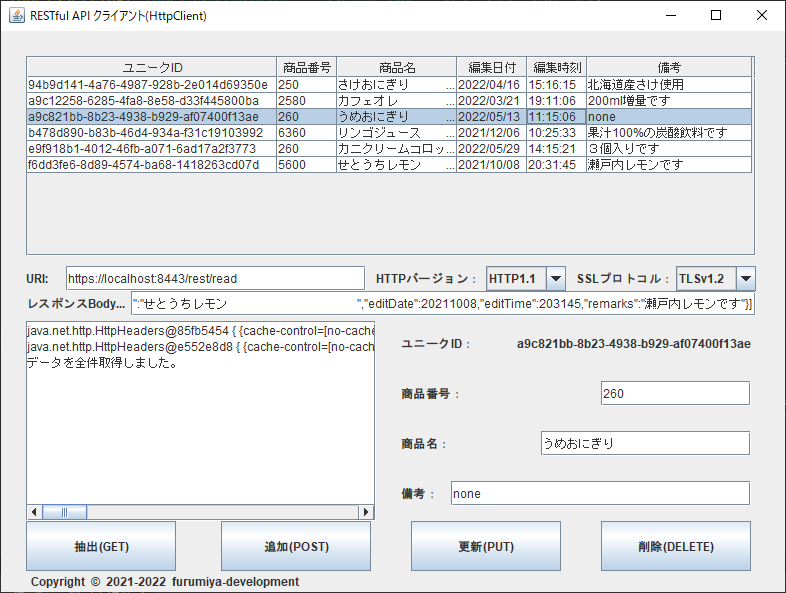
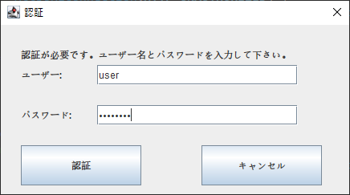

## :computer: WebAPIとHTTPS通信するデスクトップアプリ(Swing)  

### 開発環境  

```
統合開発環境： JetBrains IntelliJ IDEA 2022.3 Community Edition  
プログラム言語：Java 17  
開発SDK：Oracle JDK 17.0.5  
デスクトップ：Swing
JSONライブラリー：Jackson 2.14.1  
```

#### 画面イメージ  
  

#### 認証イメージ  
  

___